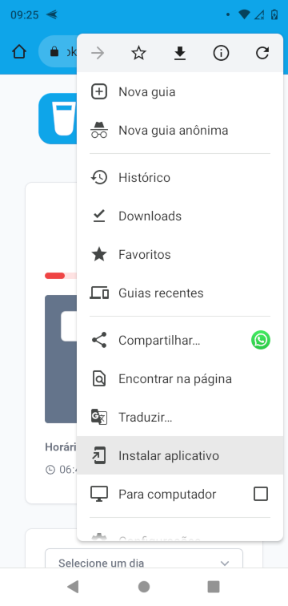

# tookwater

Simples WebApp para gerir a sua ingestão diária de água!

## Instalar

Para instalar no seu smartphone, como um app, acesse em seu navegador [tookwater.gn.dev.br](https://guilhermeasn.github.io/tookwater/), depois abra o menu do navegador e encontre a opção de instalação do web app.

## Autor

**Guilherme Neves** - [github](https://github.com/guilhermeasn/) - [website](https://gn.dev.br/)

## Licença

Este projeto está sob a licença MIT - veja o arquivo [LICENSE](https://github.com/guilhermeasn/tookwater/blob/master/LICENSE) para detalhes.
